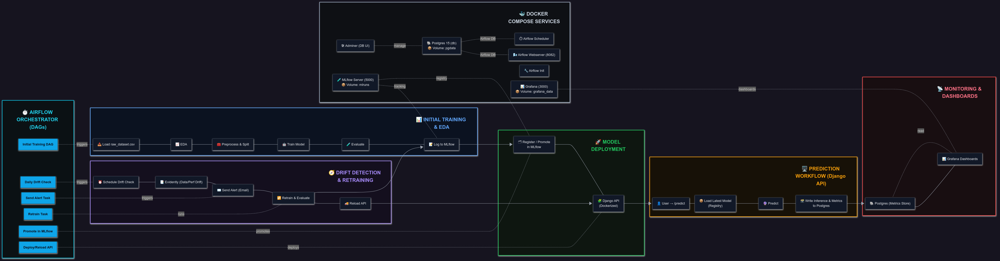

# Mini MLOps Platform — Training → Monitoring → Alerts → Retrain

> A compact, reproducible platform that automates the full model lifecycle: **initial training**, **batch monitoring**, **email alerts**, and **retraining** — all containerized with Docker Compose and orchestrated with Airflow.



---

## Why this matters

- **Data/Concept Drift is inevitable** — without continuous monitoring, your KPIs silently degrade.
- **Early warning & lower MTTR** — automatic alerts let you react before users notice.
- **Auditability** — metrics are written to **PostgreSQL** and remain fully traceable.
- **Scalability** — to onboard a new model you only add **one DAG + a small config**.

---


---

## Architecture at a glance

1. **Initial Training & EDA** → model artifact
2. **Evidently (batch)** →  **compute metrics** → **PostgreSQL**: `dummy_metrics`
3. **Grafana ↔ PostgreSQL** visualize drift and trends
4. **Airflow (`drift_alert_dag`)** → compare vs threshold → **Email alert**
5. *(Optional)* **Retrain** → log to **MLflow** → **update Django prediction service**

---

## Data & feature engineering (duration)
```python
# Compute trip duration in minutes
df["duration"] = (
    df["lpep_dropoff_datetime"] - df["lpep_pickup_datetime"]
).dt.total_seconds() / 60

# Recommended hygiene
df = df.dropna(subset=["lpep_pickup_datetime", "lpep_dropoff_datetime"])
df = df[df["duration"].between(1, 180)]  # trim obvious outliers

```

## What’s included

- **Training & EDA** — data prep and a simple **Linear Regression**; model artifact persisted as `lin_reg.bin`. *(Optional: log runs to **MLflow**.)*
- **Batch Monitoring** — compute metrics with **Evidently AI** (e.g., `prediction_drift`) and write them to **PostgreSQL** table `dummy_metrics`.
- **Dashboarding** — **Grafana** reads directly from Postgres to visualize drift trends.
- **Alerts** — an **Airflow DAG** reads the latest drift value and compares it with env var **`DRIFT_THRESHOLD`** *(default `0.20`)*. If breached, it sends an email via `EmailOperator` including the **timestamp** and **value**.
- **Containerized everything** — Docker Compose defines networks, healthchecks, and **persistent volumes** (Postgres data, MLflow runs/artifacts, Airflow logs/plugins/dags, Grafana data).

---

## Airflow automation (3 DAGs)

1. **`train_duration_model`** → run training (optionally log to MLflow if `MLFLOW_TRACKING_URI` is set).
2. **`metrics_backfill_to_postgres`** → daily/backfill script to compute metrics with Evidently and upsert into `dummy_metrics`.
3. **`drift_alert_dag`** → query the latest metric from Postgres and **email** if it exceeds `DRIFT_THRESHOLD`.

**Sample alert email**

```
Threshold breach (>0.20): 2022-02-19 20:30 — 0.2341
```

## Quickstart

**Prereqs:** Docker & Docker Compose

1. Clone the repo and copy `.env.example` to `.env`. Set:
   - `AIRFLOW_SMTP_USER`, `AIRFLOW_SMTP_PASSWORD`, `ALERT_EMAIL_TO`
   - `DRIFT_THRESHOLD` (optional, default `0.20`)
   - `MLFLOW_TRACKING_URI` (optional, e.g., `http://mlflow:5000`)
2. Bring everything up:

   ```bash
   docker compose up -d --build
   ```

3. Access UIs:
   - **Airflow**: `http://localhost:8082`
   - **Grafana**: `http://localhost:3000`
   - **MLflow**: `http://localhost:5000`
   - **Adminer (DB UI)**: `http://localhost:8080`
   - **Postgres**: `localhost:5432`

---

## Services (from `docker-compose.yml`)


```yaml
# docker-compose.yml
volumes:
  grafana_data: {}
  airflow_logs: {}
  airflow_plugins: {}
  airflow_dags: {}
  mlruns: {}
  pgdata: {}   # persistent Postgres

networks:
  front-tier:
  back-tier:

services:
  db:
    image: postgres:15
    restart: always
    environment:
      POSTGRES_USER: postgres
      POSTGRES_PASSWORD: postgres
      POSTGRES_DB: airflow
    ports:
      - "5432:5432"
    networks:
      - back-tier
    volumes:
      - pgdata:/var/lib/postgresql/data
    healthcheck:
      test: ["CMD-SHELL", "pg_isready -U postgres -d $${POSTGRES_DB}"]
      interval: 5s
      timeout: 3s
      retries: 10
      start_period: 5s

  adminer:
    image: adminer
    restart: always
    ports:
      - "8080:8080"
    networks:
      - back-tier
      - front-tier

  grafana:
    image: grafana/grafana-enterprise
    user: "472"
    ports:
      - "3000:3000"
    volumes:
      - grafana_data:/var/lib/grafana
      - ./config/grafana_datasources.yaml:/etc/grafana/provisioning/datasources/datasource.yaml:ro
      - ./config/grafana_dashboards.yaml:/etc/grafana/provisioning/dashboards/dashboards.yaml:ro
      - ./dashboards:/opt/grafana/dashboards
    networks:
      - back-tier
      - front-tier
    restart: always

  mlflow:
    image: ghcr.io/mlflow/mlflow:v2.16.0
    restart: always
    ports:
      - "5000:5000"         # UI: http://localhost:5000
    command: >
      mlflow server
      --host 0.0.0.0
      --port 5000
      --backend-store-uri sqlite:////mlruns/mlflow.db
      --artifacts-destination /mlartifacts
    volumes:
      - mlruns:/mlruns
      - ./mlartifacts:/mlartifacts
    networks:
      - back-tier
      - front-tier

  airflow-init:
    image: airflow-custom:2.9.3-py3.10
    user: "50000:0"
    entrypoint: ["/bin/bash", "/opt/airflow/scripts/airflow_init.sh"]
    environment:
      AIRFLOW_UID: "50000"
      AIRFLOW__CORE__EXECUTOR: LocalExecutor
      AIRFLOW__CORE__LOAD_EXAMPLES: "False"
      AIRFLOW__CORE__DEFAULT_TIMEZONE: Europe/Amsterdam
      AIRFLOW__DATABASE__SQL_ALCHEMY_CONN: postgresql+psycopg2://postgres:postgres@db:5432/airflow
      AIRFLOW__SMTP__SMTP_HOST: smtp.gmail.com
      AIRFLOW__SMTP__SMTP_PORT: "587"
      AIRFLOW__SMTP__SMTP_USER: ${AIRFLOW_SMTP_USER}
      AIRFLOW__SMTP__SMTP_PASSWORD: ${AIRFLOW_SMTP_PASSWORD}
      AIRFLOW__SMTP__SMTP_MAIL_FROM: ${AIRFLOW_SMTP_USER}
      AIRFLOW__SMTP__SMTP_STARTTLS: "true"
      AIRFLOW__EMAIL__EMAIL_BACKEND: airflow.utils.email.send_email_smtp
      ALERT_EMAIL_TO: ${ALERT_EMAIL_TO}
    volumes:
      - airflow_dags:/opt/airflow/dags
      - airflow_logs:/opt/airflow/logs
      - airflow_plugins:/opt/airflow/plugins
      - ./dags:/opt/airflow/dags
      - ./scripts:/opt/airflow/scripts:ro
      - ./data:/opt/airflow/data:ro
    depends_on:
      db:
        condition: service_healthy
    networks:
      - back-tier

  airflow-webserver:
    image: airflow-custom:2.9.3-py3.10
    command: webserver
    restart: always
    ports:
      - "8082:8080"
    environment:
      MLFLOW_TRACKING_URI: http://mlflow:5000
      AIRFLOW__CORE__EXECUTOR: LocalExecutor
      AIRFLOW__CORE__LOAD_EXAMPLES: "False"
      AIRFLOW__DATABASE__SQL_ALCHEMY_CONN: postgresql+psycopg2://postgres:postgres@db:5432/airflow
      AIRFLOW__SMTP__SMTP_HOST: smtp.gmail.com
      AIRFLOW__SMTP__SMTP_PORT: "587"
      AIRFLOW__SMTP__SMTP_USER: ${AIRFLOW_SMTP_USER}
      AIRFLOW__SMTP__SMTP_PASSWORD: ${AIRFLOW_SMTP_PASSWORD}
      AIRFLOW__SMTP__SMTP_MAIL_FROM: ${AIRFLOW_SMTP_USER}
      AIRFLOW__SMTP__SMTP_STARTTLS: "true"
      AIRFLOW__EMAIL__EMAIL_BACKEND: airflow.utils.email.send_email_smtp
      AIRFLOW_CONN_METRICS_DB: postgresql+psycopg2://postgres:postgres@db:5432/airflow
      ALERT_EMAIL_TO: ${ALERT_EMAIL_TO}
    volumes:
      - airflow_dags:/opt/airflow/dags
      - airflow_logs:/opt/airflow/logs
      - airflow_plugins:/opt/airflow/plugins
      - ./dags:/opt/airflow/dags
      - ./models:/opt/airflow/models
      - ./jobs:/opt/airflow/jobs
      - ./data:/opt/airflow/data:ro
    depends_on:
      airflow-init:
        condition: service_completed_successfully
    networks:
      - back-tier
      - front-tier

  airflow-scheduler:
    image: airflow-custom:2.9.3-py3.10
    command: scheduler
    restart: always
    environment:
      MLFLOW_TRACKING_URI: http://mlflow:5000
      AIRFLOW__CORE__EXECUTOR: LocalExecutor
      AIRFLOW__CORE__LOAD_EXAMPLES: "False"
      AIRFLOW__DATABASE__SQL_ALCHEMY_CONN: postgresql+psycopg2://postgres:postgres@db:5432/airflow
      AIRFLOW__SMTP__SMTP_HOST: smtp.gmail.com
      AIRFLOW__SMTP__SMTP_PORT: "587"
      AIRFLOW__SMTP__SMTP_USER: ${AIRFLOW_SMTP_USER}
      AIRFLOW__SMTP__SMTP_PASSWORD: ${AIRFLOW_SMTP_PASSWORD}
      AIRFLOW__SMTP__SMTP_MAIL_FROM: ${AIRFLOW_SMTP_USER}
      AIRFLOW__SMTP__SMTP_STARTTLS: "true"
      AIRFLOW__EMAIL__EMAIL_BACKEND: airflow.utils.email.send_email_smtp
      ALERT_EMAIL_TO: ${ALERT_EMAIL_TO}
    volumes:
      - airflow_dags:/opt/airflow/dags
      - airflow_logs:/opt/airflow/logs
      - airflow_plugins:/opt/airflow/plugins
      - ./dags:/opt/airflow/dags
      - ./models:/opt/airflow/models
      - ./jobs:/opt/airflow/jobs
      - ./data:/opt/airflow/data:ro
    depends_on:
      airflow-init:
        condition: service_completed_successfully
    networks:
      - back-tier
```


---

## Environment variables

- **`DRIFT_THRESHOLD`** → alert threshold for drift (default **`0.20`**).
- **`MLFLOW_TRACKING_URI`** → enable MLflow logging (e.g., `http://mlflow:5000`).  
- **Email (SMTP)** used by Airflow:
  - `AIRFLOW_SMTP_USER`, `AIRFLOW_SMTP_PASSWORD`, `AIRFLOW_SMTP_HOST`, `AIRFLOW_SMTP_PORT`
  - `AIRFLOW__EMAIL__EMAIL_BACKEND`, `ALERT_EMAIL_TO`

---

## Notes & extensions

- Metrics table: `dummy_metrics` (stores timestamp and metric values like `prediction_drift` for auditability).
- Retraining can register the new model in **MLflow** and trigger a **Django** API refresh.
- To scale to a new model: add a small config and **one DAG**; reuse the same Grafana/DB plumbing.
- All volumes are persisted: Postgres data (`pgdata`), MLflow (`mlruns`, `mlartifacts`), Airflow logs/plugins/dags, Grafana data.

---

**License:** MIT (feel free to adapt).
